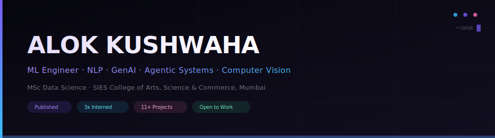

 

 

<table>
<tr>
<td width="600">

### 👋 &nbsp; About Me

I build **complete ML systems**, not just notebooks — research-grade NLP, agentic decision-intelligence platforms, biomedical & off-road computer vision, and developer tooling that's actually **shipped and deployed**.

My anchor project, **ClauseWise**, is a Legal-BERT + Graph Neural Network contract-risk system published as a **peer-reviewed paper**. I've completed **3 internships** across GenAI/ML, AI model training, and software development, and I'm currently pursuing full-time roles in applied ML, NLP, GenAI, and data science.

</td>
</tr>
</table>

 

&nbsp;&nbsp;

 

---

## 📊 &nbsp; By the Numbers

<table>
<tr>
<td align="center" width="150">
 
<strong>0.90</strong> 
ClauseWise F1-Score
</td>
<td align="center" width="150">
 
<strong>94.1%</strong> 
HemoVision Accuracy
</td>
<td align="center" width="150">
 
<strong>530+</strong> 
Clauses Analyzed
</td>
<td align="center" width="150">
 
<strong>3</strong> 
Internships
</td>
</tr>
<tr>
<td align="center" width="150">
 
<strong>1</strong> 
Peer-Reviewed Paper
</td>
<td align="center" width="150">
 
<strong>11+</strong> 
Shipped Projects
</td>
<td align="center" width="150">
 
<strong>59</strong> 
Automated Tests
</td>
<td align="center" width="150">
 
<strong>8.57</strong> 
MSc CGPA
</td>
</tr>
</table>

 

---

## 📝 &nbsp; Research & Publication

<table>
<tr>
<td>

### 🏛️ &nbsp; ClauseWise — Legal-BERT + GNN Contract Risk Analysis

Legal-BERT and Graph Neural Network based system for automated contract clause risk analysis — **F1 0.90 / 89% accuracy** across 530+ real-world clauses.

📄 &nbsp; Published in *INDJCST, Vol. 5, No. 1, 2026* — [DOI: 10.59256/indjcst.20260501041](https://doi.org/10.59256/indjcst.20260501041)
 
🎓 &nbsp; Co-authored with Faculty HOD

`Python` `Legal-BERT` `PyTorch Geometric` `scikit-learn` `Graph Neural Networks`

</td>
</tr>
</table>

 

---

## 🤖 &nbsp; Agentic AI & FinTech

<table>
<tr>
<td width="50%">

### 🏦 &nbsp; NIRNAY (निर्णय)

Agentic Financial Decision Intelligence platform — built for **SBI Hackathon 2026** (Digital Engagement theme). Targets manipulation-driven authorized payment fraud rather than traditional transaction-pattern detection.

`Node.js` `TypeScript` `Gemini`

</td>
<td width="50%">

### 🔮 &nbsp; SureVision AI

Multi-agent enterprise decision-intelligence platform with JWT-based RBAC and a custom **Stakeholder Dissent Tracker** surfacing disagreement across simulated decision-making agents.

`Next.js 15` `MongoDB` `Gemini` `JWT-RBAC`

</td>
</tr>
</table>

 

---

## 👁️ &nbsp; Computer Vision

<table>
<tr>
<td width="50%">

### 🔬 &nbsp; HemoVision

CNN-based blood cell classification on **BloodMNIST** (8 classes) with Grad-CAM interpretability and PCA/t-SNE embedding analysis — **94.1% accuracy, 0.932 macro F1**.

`PyTorch` `scikit-image` `Grad-CAM`

</td>
<td width="50%">

### 🌄 &nbsp; Off-road Semantic Segmentation

Terrain segmentation for off-road driving scenes — built for **Hawkathon 2026 (Duality AI)** using DeepLabV3+ with a ResNet-50 backbone.

`DeepLabV3+` `ResNet-50` `OpenCV`

</td>
</tr>
</table>

 

---

## 📈 &nbsp; Data & Business Analytics

<table>
<tr>
<td>

### 🚛 &nbsp; RouteScope

Freight & logistics operations analytics — SQL-driven analysis (joins, CTEs, window functions) over shipment data, carrier/route performance dashboards, and a business requirement document (BRD) translating findings into recommendations.

`Python` `SQLite` `pandas` `matplotlib`

</td>
</tr>
</table>

 

---

## 🛠️ &nbsp; Developer Tooling & Platforms

<table>
<tr>
<td width="33%">

### 📦 &nbsp; predeploy-check

npm CLI catching Render/Vercel deployment failures before they happen — shipped through **v1.2.0**, 59 tests, `--json` output, `--live` PyPI verification.

`Node.js` `npm`

</td>
<td width="33%">

### 🎯 &nbsp; SHL Assessment Recommender

Conversational assessment-recommendation system built as a technical take-home assignment, deployed on Render.

`FastAPI` `FAISS` `Gemini 2.5 Flash`

</td>
<td width="34%">

### 🌐 &nbsp; Portfolio

13-project developer portfolio, built with Next.js, deployed on Vercel.

`Next.js` `Vercel`

</td>
</tr>
</table>

 

---

## ⚡ &nbsp; Hackathons & Systems Engineering

<table>
<tr>
<td width="50%">

### 🏆 &nbsp; Appointment Booking System

Built during a 24-hour **Odoo VIT Hackathon** — MongoDB TTL-based double-booking prevention.

`MongoDB` `TTL Indexes`

</td>
<td width="50%">

### 🔧 &nbsp; Schedulix

Debugged a Node.js/Express/Mongoose booking backend — resolved SMTP misconfiguration, Markdown-corrupted error-handler conditions, and a double-save Mongoose pattern.

`Node.js` `Express` `Mongoose`

</td>
</tr>
</table>

 

---

## 🧰 &nbsp; Tech Stack

<table>
<tr>
<td align="center" width="100">
 
<b>Python</b>
</td>
<td align="center" width="100">
 
<b>TypeScript</b>
</td>
<td align="center" width="100">
 
<b>Node.js</b>
</td>
<td align="center" width="100">
 
<b>React</b>
</td>
<td align="center" width="100">
 
<b>Next.js</b>
</td>
<td align="center" width="100">
 
<b>MongoDB</b>
</td>
</tr>
<tr>
<td align="center" width="100">
 
<b>PyTorch</b>
</td>
<td align="center" width="100">
 
<b>TensorFlow</b>
</td>
<td align="center" width="100">
 
<b>scikit-learn</b>
</td>
<td align="center" width="100">
 
<b>FastAPI</b>
</td>
<td align="center" width="100">
 
<b>Docker</b>
</td>
<td align="center" width="100">
 
<b>Git</b>
</td>
</tr>
</table>

 

<b>📋 &nbsp; Full Stack Breakdown</b>

 

| Domain | Technologies |
|:---|:---|
| **ML / Deep Learning** | PyTorch · TensorFlow · Legal-BERT · GNNs (PyTorch Geometric) · CNNs · DeepLabV3+ · SegFormer · scikit-learn · scikit-image · Grad-CAM · PCA/t-SNE |
| **GenAI / Retrieval** | Gemini 2.5 Flash · FAISS · RAG pipelines · Multi-agent architectures |
| **Backend** | Node.js · Express · FastAPI · TypeScript · JWT-RBAC |
| **Frontend** | React · Next.js 15 · Tailwind CSS |
| **Data** | SQL (SQLite) · pandas · NumPy · matplotlib · seaborn |
| **Infra / Tooling** | Docker · Git · npm packaging · Render / Vercel |

 

---

## 📈 &nbsp; Contribution Graph

 

 

---

### 🚀 &nbsp; Open to Full-Time Roles

**Applied ML · NLP · GenAI · Data Science · Computer Vision**

 

&nbsp;

&nbsp;

 

  

⚡ Built systems. Published research. Shipped products. Let's build something extraordinary.

